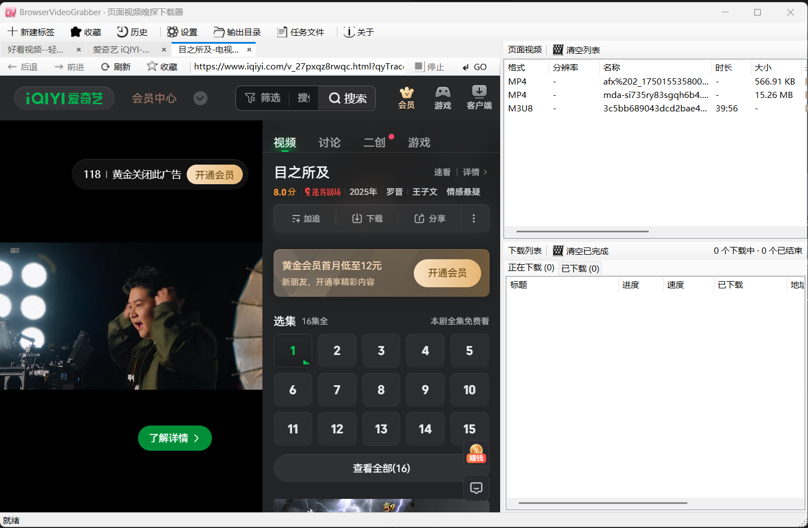

# 🎬 BrowserVideoGrabber

> 在网页里看视频，眼睛过了瘾，手指却空落落？**BrowserVideoGrabber** 把这件事变简单了：内置浏览器开网页，视频资源自动跳进嗅探列表，双击就能下载到本地。一个标签页看不完？一键新开一个。喜欢这个页面？点个 ⭐ 收进收藏夹。

<p align="center">
  <em>Built with ❤️ — .NET 10 · Windows Forms · WebView2 (Edge Chromium)</em>
</p>

<p align="center">
  <a href="README.en.md">🇬🇧 English Version</a> · <a href="README.md">🇨🇳 中文</a>
</p>



---

## ✨ 它能做什么？

| 能力 | 说明 |
|---|---|
| 🕵️ 页面视频嗅探 | 网络响应监听 + URL 特征匹配 + JS Hook 注入三管齐下，直链、动态地址、MSE 分片都能抓 |
| 🧩 一视频一记录 | 同一个视频的主清单、各档清晰度变体、上千个分片会**自动归并成一行** —— 看起来干净清爽，下载拿到的是完整文件 |
| 📦 多格式下载 | `m3u8` / `ts` / `m4s` / `mpd`（DASH）走 ffmpeg；`mp4` 走原生 HTTP 多线程分片下载，速度飞起 |
| ⏸️ 断点续传 | MP4 采用 `.partN` 分片，中断后重试只补齐缺失部分，不会从头再来 |
| 🍪 登录态复用 | 自动从内嵌浏览器导出 Referer / UA / Cookie —— 需登录才能看的视频也能下载 |
| 📑 多标签浏览 | `<a target="_blank">` 不会弹独立窗口，而是**新开一个标签页**，共享会话、登录态、收藏夹 |
| ⭐ 收藏夹 | 看上哪个页面就按一下 ☆，下次直接从收藏夹打开，不用再敲网址 |
| 🎛️ 队列调度 | 并发上限可配置，失败按指数退避自动重试，暂停 / 恢复 / 取消随时切换 |
| 💾 任务持久化 | 任务列表和设置自动落盘，**重启即恢复**，刚才下载到一半的东西接着来 |
| 🔧 缺失自检 | 没找到 ffmpeg？顶部出个橙色横幅，底部状态栏给提示，还带安装引导 |

### 🔐 加密边界（请在使用前了解）

| 情况 | 是否支持 |
|---|---|
| 无加密视频 | ✅ 支持 |
| `#EXT-X-KEY:METHOD=AES-128` | ✅ ffmpeg 自动取 key 解密 |
| `SAMPLE-AES` / `SESSION-KEY`（DRM） | ❌ **不支持** —— 直接判定失败，**不做无意义重试** |

> 本工具不绕过任何 DRM 保护，仅用于下载未受保护的内容。请遵守版权法规与站点使用条款。

---

## 🧰 环境要求

| 组件 | 要求 |
|---|---|
| 操作系统 | Windows 10 1809+ / Windows 11 |
| .NET SDK | **10.0**（构建需要；仅运行需 .NET 10 Desktop Runtime） |
| WebView2 Runtime | Win10/11 通常已内置；缺失时从 [微软官网](https://developer.microsoft.com/microsoft-edge/webview2/) 安装 Evergreen Runtime |
| ffmpeg | **可选但强烈建议**。缺失时 m3u8/mpd/ts/m4s 无法下载，MP4 直链不受影响 |

---

## 📥 ffmpeg 安装

程序**不随包分发 ffmpeg**（体积大、许可与维护成本高），改为运行时自动探测：

1. 「设置」中手工指定的路径
2. 程序目录下 `tools\ffmpeg\ffmpeg.exe`（绿色版打包用）
3. 程序目录下 `ffmpeg.exe`
4. 系统 `PATH` 环境变量
5. 常见位置：`%USERPROFILE%\scoop\shims`、`C:\ProgramData\chocolatey\bin`、`C:\ffmpeg\bin`

### 推荐安装方式

```powershell
# 最省事（winget / scoop / choco 任选其一）
winget install Gyan.FFmpeg
# 或
scoop install ffmpeg
# 或
choco install ffmpeg
```

**或手动下载**：从 [gyan.dev](https://www.gyan.dev/ffmpeg/builds/) 下 `ffmpeg-release-essentials.zip`，解压到任意目录后把 `bin` 加进系统 PATH，**重启本程序**即可。

**绿色打包**：把 `ffmpeg.exe` 放进程序目录的 `tools\ffmpeg\` 子目录，PATH 都不用改。

程序启动后，底部状态栏右侧会显示 `ffmpeg：<路径>`；没找到时顶部出现橙色横幅。

---

## 🏗️ 构建与运行

```powershell
# 还原并构建（单项目，已合并）
dotnet build src/BrowserVideoGrabber/BrowserVideoGrabber.csproj -c Release

# 运行单元测试（265 个用例，覆盖 Core 与 Infrastructure 两层）
dotnet test tests/BrowserVideoGrabber.Core.Tests/

# 启动
.\src\BrowserVideoGrabber\bin\Release\net10.0-windows\BrowserVideoGrabber.exe
```

> 注意：旧 README 里的 `.slnx` 已废弃，直接编 csproj 即可。

---

## 🚀 五分钟上手

### 界面长啥样？

```
┌─ 标签条 ← →  ⟳  ☆  [ 地址栏 spring 撑满 ]  GO  ⏹ ────────────────────────────┐
│                                                                                 │
│   左：浏览器（标签页切换）          │        右上：嗅探面板                     │
│                                    │        格式 / 清晰度 / 名称 / 地址          │
│                                    ├────────────────────────────────────────────┤
│                                    │        右下：下载任务管理                  │
│                                    │        待下载 / 正在下载 / 已下载           │
│                                    │        暂停 · 恢复 · 取消 · 重试 · 打开    │
├─────────────────────────────────────────────────────────────────────────────────┤
│  就绪 或 加载中…                                                  ffmpeg：就绪    │ ← 状态栏
└─────────────────────────────────────────────────────────────────────────────────┘
```

### 典型流程

1. 打开程序，地址栏输入网址（关键词也能输 —— 自动 Bing 搜索）
2. **登录需要登录的站点**（关键！登录态会被下载请求复用）
3. 播放视频，等几秒，右上角嗅探面板自动冒出资源 👀
4. **双击**某条 → 加入下载；或右键「加入下载」
5. 右下切到「正在下载」看进度条；下好了在「已下载」里双击直接打开

### 小技巧

| 场景 | 做法 |
|---|---|
| 想在新标签打开链接 | 页面上的 `<a target="_blank">` 自动新开 tab；也可以在地址栏输入 URL 后右键标签条「新建」 |
| 快速收藏当前页 | 点工具栏 ☆ 按钮；从收藏夹 Form 里统一管理 |
| 嗅探列表满了想重来 | 右键嗅探面板「清空列表」，再刷新页面重新播放 |
| 下载中断了 | 直接点「恢复」，MP4 自动续传未下载的分片 |
| ffmpeg 找不到 | 看状态栏 → 点「设置」→ 要么自动探测，要么手工指定路径 |

### 设置项速览

| 项目 | 说明 |
|---|---|
| ffmpeg 路径 | 留空表示自动探测（推荐） |
| 输出目录 | 下载文件默认存 `%USERPROFILE%\Downloads` |
| 并发下载数 | 默认 3；过高可能触发站点限流 |
| MP4 分片数 | 默认 4；设为 1 = 单连接 |
| User-Agent | 留空则跟内嵌浏览器当前 UA 一致 |
| 启动时自动嗅探 | 关闭后启动不自动嗅探，可随时手动开 |

> 修改并发数 / MP4 分片数会重建下载管线，正在下载的任务会被取消后自动重排队。

### 文件在哪？

| 文件 | 默认路径 |
|---|---|
| 设置 | `%LOCALAPPDATA%\BrowserVideoGrabber\settings.json` |
| 任务列表 | `%LOCALAPPDATA%\BrowserVideoGrabber\tasks.json` |
| 收藏夹 / 历史 | 同上目录下的 `favorites.json` / `history.json` |
| 运行日志 | `%LOCALAPPDATA%\BrowserVideoGrabber\logs\app.log` |
| 浏览器缓存 / 登录态 | `%LOCALAPPDATA%\BrowserVideoGrabber\WebView2` |

工具栏里有「打开任务文件」按钮，一键直达上述目录。

---

## 🧪 手工冒烟清单（26 项）

265 个单元测试覆盖嗅探匹配、m3u8 解析、ffmpeg 参数与进度、下载队列、分片续传等纯逻辑层。**界面与真实网站交互行为需要人工确认**，建议按此清单跑一遍：

| # | 用例 | 预期 |
|---|---|---|
| 1 | 双击运行 | 主窗口正常显示，无错误弹窗 |
| 2 | 看底部状态栏 | 有 ffmpeg → 显示路径；无 → 显示「未找到」且顶部有橙色横幅 |
| 3 | 输入 `bing.com` 回车 | 地址栏自动补全 `https://`，页面打开 |
| 4 | 输入「测试」回车 | 走搜索，不把关键词当网址 |
| 5 | 后退 / 前进 | 无历史时按钮自动置灰 |
| 6 | 播放含 MP4 直链的页面 | 右上出现 MP4 记录，来源列显示「网络」或「脚本」 |
| 7 | 播放 HLS（m3u8）页面 | **整页只一条该视频记录**（清单 + 各档清晰度 + 上千分片自动归并） |
| 8 | 双击嗅探里的 MP4 | 右下进度条推进，100% 后文件生成在输出目录 |
| 9 | MP4 下载中点「暂停」 | 回到「待下载 - 已暂停」，网络请求停止 |
| 10 | 点「恢复」 | 重新开始并完成下载 |
| 11 | 下载一个 m3u8 任务 | ffmpeg 被调用，进度按时间码推进，输出可播放 mp4 |
| 12 | 下载大文件时断网再恢复 | 自动重试；已下载分片保留，**不从头来** |
| 13 | 下载中点「取消」 | 输出目录不残留 `.part` / `.assembling` 文件 |
| 14 | DRM 保护视频发起下载 | 立即失败 + 明确提示，不反复重试 |
| 15 | 登录后下载需登录的视频 | 成功（Cookie / Referer 注入生效） |
| 16 | 已下载页签双击完成任务 | 系统默认播放器打开文件 |
| 17 | 右键「打开所在文件夹」 | 资源管理器定位到该文件 |
| 18 | 关闭再打开程序 | 已下载列表 + 上次访问的标签页自动恢复 |
| 19 | 把并发数改为 1 | 提示生效，同一时刻只一个任务在跑 |
| 20 | 手工填一个不存在的 ffmpeg 路径 | 弹出路径不存在的确认 |
| 21 | 页面已经开始播放**后**才开嗅探 | 可能先抓到 TS 分片；此时发起下载会先弹「只下载到片段」提示 |
| 22 | 接 21，刷新页面重放 | 原来那条分片记录**原地升级**为 M3U8（不新增第二行） |
| 23 | 若干任务后在「待下载」里右键移除 | 该行消失，重启后不复活 |
| 24 | 在「正在下载」行右键 | 「从列表移除」为禁用（需先取消） |
| 25 | 失败任务切到「已下载」 | 「说明」列显示具体原因（缺 Referer / Cookie 等） |
| 26 | 清空嗅探列表后重放同一视频 | 能**重新嗅探出来**（清空同时清掉了去重记录） |

---

## 🏛️ 项目结构（单项目，已合并）

```
src/BrowserVideoGrabber/
├── Program.cs                      # 入口 + 异常落盘
├── BrowserVideoGrabber.csproj      # 单项目：.NET 10 WinForms + WebView2
├── AppHost.cs                       # 手写组合根，统一 DI
├── AboutForm.cs                     # 关于页 + 使用免责声明
│
├── App/                             # 界面层
│   ├── Forms/MainForm.cs            # 主窗体
│   ├── Forms/FavoritesForm.cs       # 收藏夹管理
│   ├── Forms/HistoryForm.cs         # 浏览历史
│   ├── Forms/SettingsForm.cs        # 设置对话框
│   ├── Panes/BrowserPane.cs         # 浏览器容器（标签管理 + 工具栏）
│   ├── Panes/BrowserTab.cs          # 单个 WebView2 标签页
│   ├── Panes/BrowserTabStrip.cs     # 自绘标签条
│   ├── Panes/SniffPane.cs           # 嗅探列表面板
│   ├── Panes/DownloadPane.cs        # 下载任务面板
│   ├── Binding/                     # 列表绑定（进度节流）
│   └── Controls/BufferedListView.cs # 双缓冲列表控件
│
├── Core/                            # 领域层（零 UI 依赖，单元测试主战场）
│   ├── Models/                      # SniffedVideo · DownloadTask · DownloadProgress …
│   ├── Abstractions/                # IVideoSniffer · IDownloadHandler · IProcessRunner …
│   ├── Sniffing/                    # VideoUrlMatcher（URL + Content-Type 判定）
│   ├── Downloads/                   # VideoFamilyIndex · HlsPlanBuilder · M3u8Parser …
│   ├── Ffmpeg/                      # FfmpegArgumentBuilder · FfmpegProgressParser
│   └── Common/                      # Result · RetryPolicy
│
└── Infrastructure/                  # 基础设施层（与真实世界交互）
    ├── Sniffing/WebView2Sniffer.cs  # 三条嗅探链路协调
    ├── Sniffing/JsHookInjector.cs   # 注入 JS 捕获动态地址
    ├── Downloads/HttpDownloadHandler.cs    # MP4 多线程分片
    ├── Downloads/FfmpegDownloadHandler.cs  # m3u8 / mpd
    ├── Ffmpeg/FfmpegLocator.cs              # ffmpeg 自动探测
    ├── Security/CookieExporter.cs           # 从 WebView2 导出 Cookie / UA / Referer
    ├── Execution/ProcessRunner.cs           # ffmpeg 进程管理
    ├── Storage/JsonTaskRepository.cs        # 任务 / 设置 / 收藏 / 历史持久化
    └── BrowserTab.cs  # 部分 WebView2 封装已提升到 App/Panes
```

### 分层依赖方向

```
App (UI) ──▶ Infrastructure ──▶ Core (领域模型 + 纯算法)
   ▲                                │
   └────────────────────────────────┘
      Infrastructure 实现 Core 的接口
```

`Core` 不引用任何 UI 或平台类型，所以它的全部逻辑（嗅探判定、m3u8 解析、ffmpeg 参数、队列调度、分片续传）都能靠注入假实现跑**确定性单元测试** —— 不联网、不触盘、不起真实进程。

---

## ⚠️ 已知限制

| 限制 | 说明 |
|---|---|
| DRM 内容 | **不支持**（设计取舍） |
| `blob:` 地址 | MSE 播放时可能拿不到直链；JS Hook 尽力还原前缀 URL，但不保证成功 |
| 动态签名地址 | 部分站点地址短时失效；嗅探后尽快下载，失败时重放页面再嗅探 |
| Referer 精度 | 取浏览器顶层文档地址；若站点校验 iframe 内地址可能 403 |
| 超大嗅探列表 | 最多跟踪 800 个视频，达上限后淘汰最早记录（新资源仍正常上报） |
| 只抓到分片 | 嗅探开关是在**播放之后**才开的话，可能只剩 TS 分片记录；此时刷新页面重放即可抓到清单 |
| 直播流 | HLS 直播（无 `#EXT-X-ENDLIST`）会持续下载，需手动取消 |

---

## 🙋 常见问题

**Q：双击程序没反应 / 一闪而过？**
看 `%LOCALAPPDATA%\BrowserVideoGrabber\logs\app.log`，里面有完整异常堆栈。

**Q：WebView2 初始化失败？**
安装 [Microsoft Edge WebView2 Evergreen Runtime](https://developer.microsoft.com/microsoft-edge/webview2/) 后重试。

**Q：MP4 能下但 m3u8 一直失败？**
先看状态栏是不是「ffmpeg：未找到」。如果不是，多半是该站点校验 Referer / Cookie —— 确认已在内置浏览器里登录，刷新页面重新播放再嗅探。

**Q：下载速度慢？**
m3u8 走 ffmpeg 单连接顺序拉取，速度受站点限速影响；MP4 可在设置里提高分片数。但并发过高反而会被站点限流，得不偿失。

**Q：为什么不直接用浏览器右键「视频另存为」？**
浏览器自带的右键菜单经常被站点屏蔽；另外它不能下 m3u8 这种流式地址。BrowserVideoGrabber 在**网络层**直接抓资源，绕过前端一切花活。

**Q：我用来学习 / 研究某视频平台的反爬机制，这合法吗？**
请遵守目标站点的使用条款和所在地区的版权法规。本工具仅用于下载**无 DRM 保护**的内容，不绕过任何加密或校验措施。

---

<p align="center">
  <sub>🎥 BrowserVideoGrabber · Keep it sniffer-y</sub>
</p>
